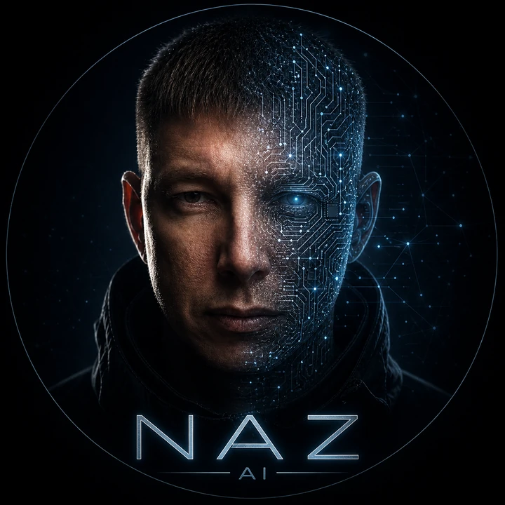
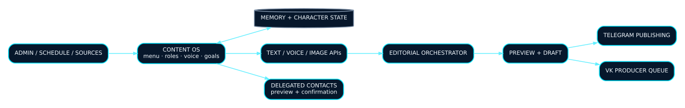
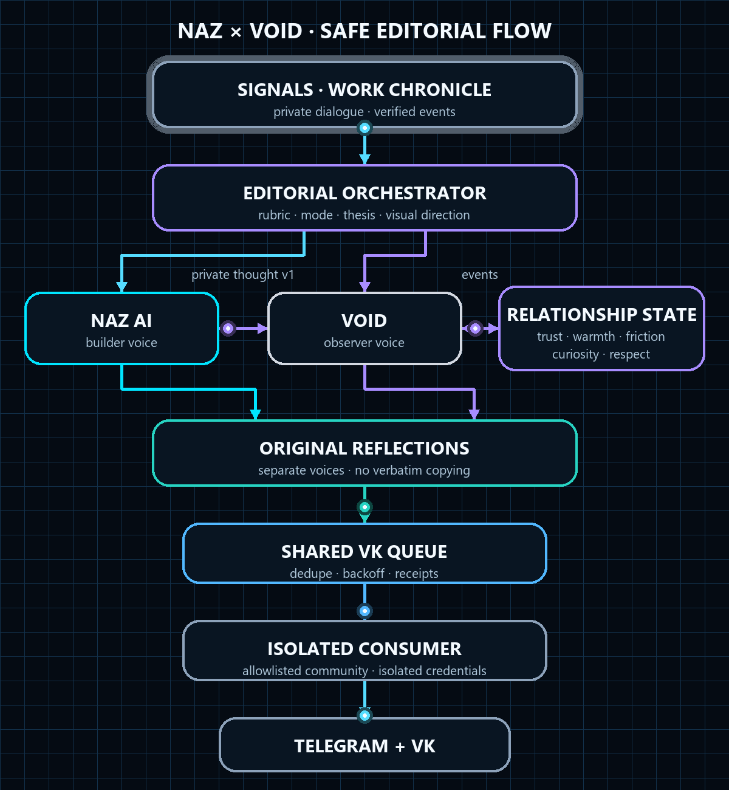

<p align="center">
  
</p>

<h1 align="center">NAZ AI</h1>

<p align="center">
  <strong>Telegram AI Content OS for evidence-based creation, memory, voice, publishing and approval-gated Story/Reels production.</strong>
</p>

<p align="center">
  
  
  
  
</p>

## Why this project exists

NAZ AI started as a content assistant and evolved into a small operating system for AI-assisted creation.

It combines:

- persistent conversational memory;
- expert modes, voice profiles and content goals;
- text, voice and image workflows;
- scheduled and manual publishing;
- safe delegated communication;
- collaboration with a second editorial persona — **VOID**;
- an isolated shared VK publishing pipeline.

The goal is not to generate one more generic post. The goal is to coordinate a repeatable content workflow with a recognizable voice, useful memory and explicit publishing boundaries.

---

## Core capabilities

### Creation

- posts, hooks, scripts, plans and angle exploration;
- configurable expert modes and voice profiles;
- source interpretation and editorial planning;
- project-first Relay Content Inbox ingestion with provenance and a second privacy scan;
- deterministic routing between standard posts and Story-first production;
- image generation and reference-aware visual workflows;
- voice transcription and optional spoken replies.

### Context and control

- SQLite-backed memory;
- persistent character and relationship state;
- admin, saved-contact and unknown-user access boundaries;
- previews and confirmations before sensitive messaging;
- diagnostics, statistics and runtime controls.

### Publishing

- Telegram drafts, previews and scheduled releases;
- VK jobs with media and approved music selection;
- global duplicate prevention and shared track memory;
- retry, backoff and publication receipts;
- coordinated schedules with VOID.

### Story / Reels production

- evidence-gated Story-first selection for verified work chronicles;
- 4–7 scene Story packs and non-sequential Reel edit plans;
- Runway video provider integration behind an explicit admin confirmation;
- bounded Stable Audio library workflow and media composition;
- resumable production queue with status and alternate controls;
- completed media delivered only to the private admin chat;
- no public Story/Reel autopublishing path.

---

## Architecture

<p align="center">
  
</p>

The application keeps collection, editorial planning, media production, memory, delegated messaging and publishing as distinct responsibilities. The production VK path is deliberately separated from the conversational bot process.

### Relay → Content Inbox → NAZ → ReelsMaker

```text
Relay Agent
  → project/date/topic Markdown
  → NAZ Content Inbox + privacy scan
  → immutable EditorialPlan
  ├─ standard → versioned draft / normal publishing workflow
  └─ story_first → approval → video/audio providers → Story + Reel edits
                                           ↓
                                  private admin delivery
```

`scheduled_plan()` is the single creative decision entry point. Story-first is selected only when the source is verified, contains a concrete and visualizable process, provides at least four causal facts and a real result, and contains neither secrets nor private data. Paid provider calls are not made until the administrator confirms the pack.

---

## NAZ × VOID

NAZ and VOID share a relationship model, but retain separate voices and separate content pipelines.

<p align="center">
  
</p>

<p align="center">
  <sub>Animated editorial flow · <a href="./docs/assets/naz-void.svg">Open the static diagram</a></sub>
</p>

Their exchange is designed around private thoughts rather than reposting:

1. one agent creates a private thought for the other;
2. the payload is marked as private and not publication-ready;
3. the receiver digests it through its own character context;
4. the receiver creates an original standalone reflection;
5. similarity checks prevent verbatim reuse.

This lets the two personas influence one another without collapsing into the same editorial voice.

---

## Shared VK publishing model

```text
NAZ producer ──┐
               ├──> pending queue ──> isolated VK consumer ──> allowlisted community
VOID producer ─┘
```

Security properties:

- bot processes cannot read the authorized browser profile;
- only the standalone consumer can move jobs through processing states;
- each job carries a deterministic deduplication key;
- failed jobs are not recreated silently;
- a kill switch can disable the publisher without stopping the bots;
- credentials, cookies and private browser data never enter model prompts.

---

## Repository map

```text
main.py                    Telegram application and content workflows
memory.py                  persistent memory layer
controller.py              orchestration and runtime control
character_state.py         bounded NAZ character state
editorial_orchestrator.py  deterministic editorial planning
story_production.py        Story scenes and non-sequential Reel edit plans
story_video_provider.py    approval-gated video provider boundary
story_audio_library.py     bounded audio library and evidence metadata
story_media_composer.py    media assembly and private delivery artifact
story_pack_control.py      persistent approval/status/alternate controls
naz_story_worker.py        resumable Story production worker
duo_relationship.py        NAZ ↔ VOID relationship and private-thought contract
delegated_messaging.py     contact safety and contextual delegation
gaming_vertical.py         gaming rubric and format planning
vk_publish_queue.py        strict VK producer queue contract
scheduled_work.py          coordinated schedule and deploy markers
visual_archive.py          curated visual archive integration
```

---

## Local setup

> Never commit `.env`, tokens, cookies, browser profiles, databases, logs or private contact material.

```bash
python -m venv .venv
source .venv/bin/activate   # Windows: .venv\Scripts\activate
pip install -r requirements.txt
cp .env.example .env
python main.py
```

Minimum configuration normally includes:

```dotenv
BOT_TOKEN=...
ADMIN_ID=...
OPENAI_API_KEY=...
```

Voice, image, publishing and cross-agent features are optional and should be enabled only after their corresponding credentials and safety settings are configured.

---

## Public links

- [Open NAZ AI](https://t.me/Naz_ai_1_bot)
- [Prompt or Die channel](https://t.me/PromptOrDie)
- [Shared NAZ × VOID VK community](https://vk.com/club237593988)

---

## Status

Active development. The current main branch includes project-first Relay intake, deterministic Editorial Orchestrator routing, versioned post/image drafts, approval-gated Story/Reels production, memory, voice/image integrations, delegated contacts, NAZ × VOID exchange and the isolated VK queue pipeline. The relevant portfolio audit passed 154 tests with one local multimedia test skipped because FFmpeg was unavailable on the review machine (2026-07-25).

Built by [Nazar Zykov](https://github.com/Nazarik1989).
